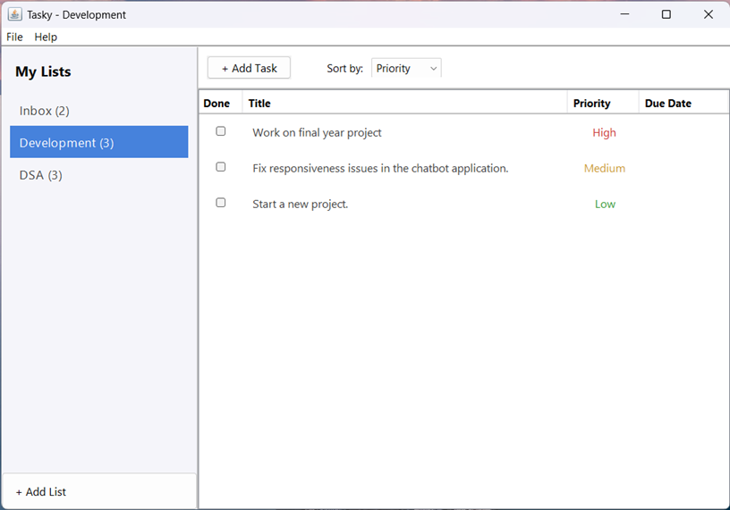
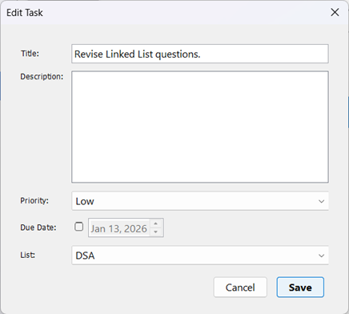

# Tasky

A simple task management application written for Windows written in Java.



## Features

- Create, edit, and delete tasks
- Organize tasks into custom lists
- Default "Inbox" for quick capture
- Set priority levels (High, Medium, Low)
- Add due dates
- Data stored locally — works offline



## Requirements

- Java 11 or higher
- Maven

## Quick Start

```bash
# Clone the repo
git clone https://github.com/kar71key/Tasky.git
cd Tasky

# Build and run
mvn clean package
java -jar target/tasky-1.0-SNAPSHOT.jar
```

Or simply double-click `run.bat` on Windows.

## Tech Stack

- Java Swing (UI)
- Gson (JSON persistence)
- Maven (build)
